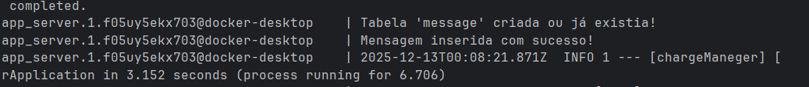
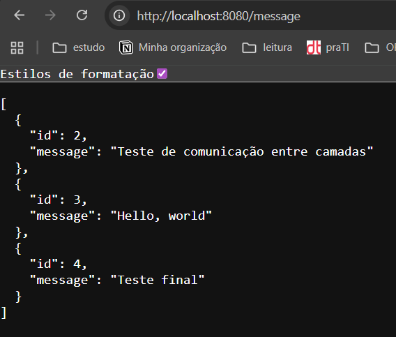

# Charge Manager - Sistema de Gerenciamento de Cobranças

Este projeto implementa um sistema completo de gerenciamento de cobranças, com comunicação via HTTP e integração com um gateway de pagamentos , oASAAS.

## Organização do projeto

### Entregas

1.  Módulos ativados via docker com uma rota funcional
    passando por todos os módulos e camadas indo até o BD 
2. Comunicação o ASAAS e disponibilização webhook funcional
3. Implementação das regras de negócio no manager e interação com os demais
   componentes/módulos
    
### Executando o projeto

- Para limpar a pasta target/, compilar o projeto e gerar o WAR:

``
Abra o painel do Maven -> Lifecycle -> clean -> package
``

- Cria imagem contendo o .WAR da aplicação no servidor Apache TomCat

``
docker build -t charge-images/chargemanager:1.0 .
``

- Iniciar o Swarm na Aplicação Docker

``
docker swarm init
``

- Subir serviços no Swarm

``
docker stack deploy -c docker-swarm.yml app
``

- Verifique se os serviços estão em execução

``
docker service ls
``
- Para verificar os logs e confirmar que a tabela foi criada use

``docker service logs app_server --follow  ``

 **Mensagem eesperada**

- Quando serviço estiver em execução adicione a URL no navegador

``
http://localhost:8080/message
``

Messagem esperada

- Para adicionar uma nova mensagem no banco use a URL : **http://127.0.0.1:8080/message/post**
e use no corpo da requisição esse formato

``{
    "id": 1,
    "message": "Teste"
}``

- Para visualizar no pgadmin use:

``
hostname = localhost
porta = 5432
database = charge_db
``